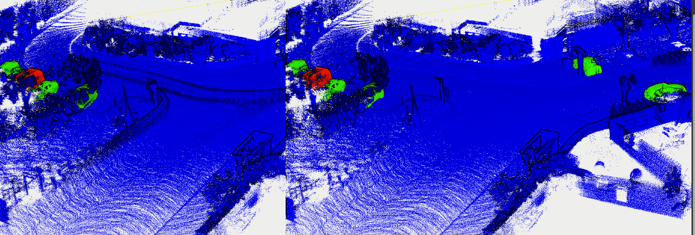

ERASOR
---

This is no ros version! Origin one please check fork repo.

pcd files are enough to run this program. Need transformed and pose in VIEWPOINT. 

Please reference our [DynamicMap benchmark](https://github.com/KTH-RPL/DynamicMap_Benchmark) for more detail on datasets.


## Build & RUN
```bash
mkdir build && cd build
cmake .. && make
./erasor_run /home/kin/data/00 ../config/seq_00.yaml -1
```
- `-1` means all frames in the pcd folder, default is only 1 frame.


You can use pcl_view to compare with gt under `/home/kin/data/00`, like this:
```
pcl_viewer -multiview 1 gt_cloud.pcd erasor_output.pcd
```
Or in CloudCompare:


Dependencies:
1. PCL

2. glog gflag (only for print)
   
    ```bash
    sh -c "$(wget -O- https://raw.githubusercontent.com/Kin-Zhang/Kin-Zhang/main/Dockerfiles/latest_glog_gflag.sh)"
    ```

3. yaml-cpp
    Please set the FLAG, check this issue if you want to know more: https://github.com/jbeder/yaml-cpp/issues/682, [TOOD inside the CMakeLists.txt](https://github.com/jbeder/yaml-cpp/issues/566)

    If you install in Ubuntu 22.04, please check this commit: https://github.com/jbeder/yaml-cpp/commit/c86a9e424c5ee48e04e0412e9edf44f758e38fb9 which is the version could build in 22.04

    ```sh
    cd ${Tmp_folder}
    git clone https://github.com/jbeder/yaml-cpp.git && cd yaml-cpp
    env CFLAGS='-fPIC' CXXFLAGS='-fPIC' cmake -Bbuild
    cmake --build build --config Release
    sudo cmake --build build --config Release --target install
    ```
    
### Cite Papers

This work is refactored during our DynamicMap benchmark. 

Please also cite original work by clicking to the fork on top (core method).

```
@inproceedings{zhang2023benchmark,
  author={Zhang, Qingwen and Duberg, Daniel and Geng, Ruoyu and Jia, Mingkai and Wang, Lujia and Jensfelt, Patric},
  booktitle={IEEE 26th International Conference on Intelligent Transportation Systems (ITSC)}, 
  title={A Dynamic Points Removal Benchmark in Point Cloud Maps}, 
  year={2023},
  pages={608-614},
  doi={10.1109/ITSC57777.2023.10422094}
}
```